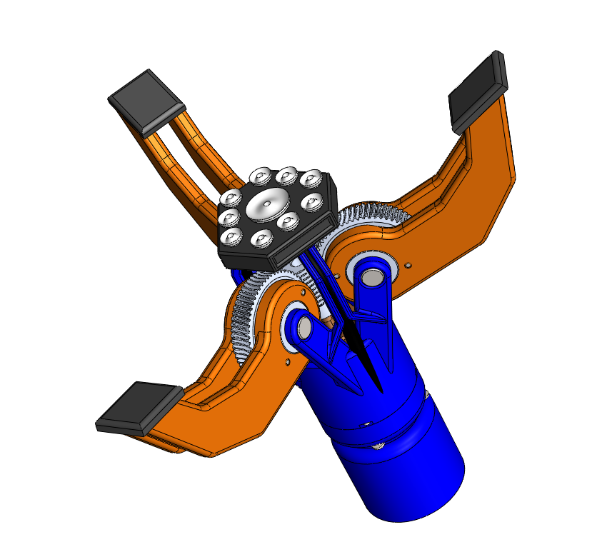
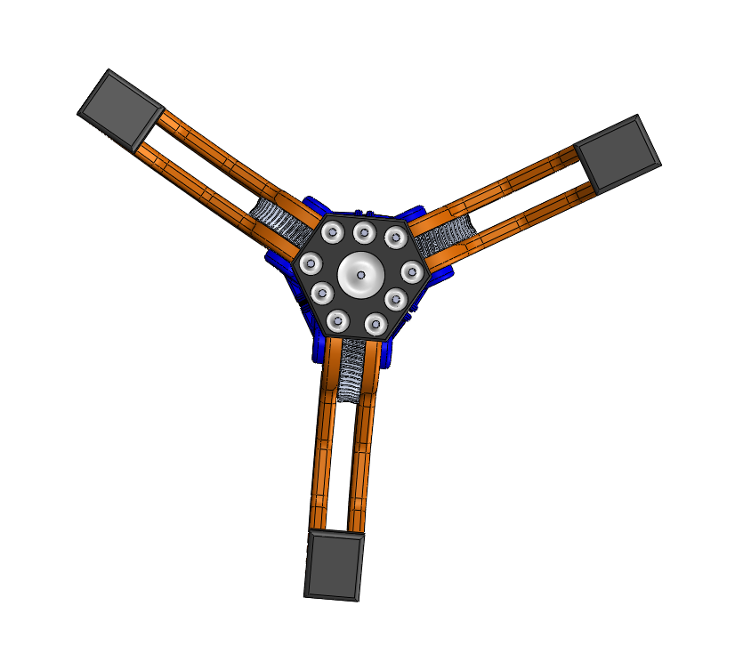
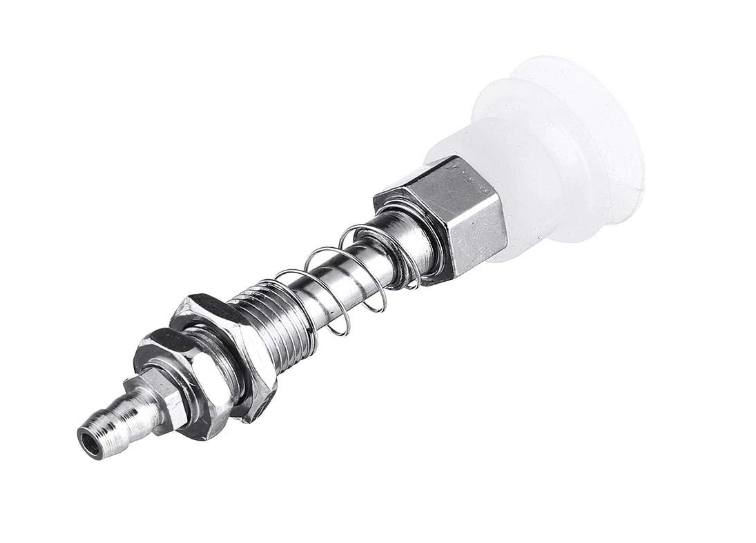
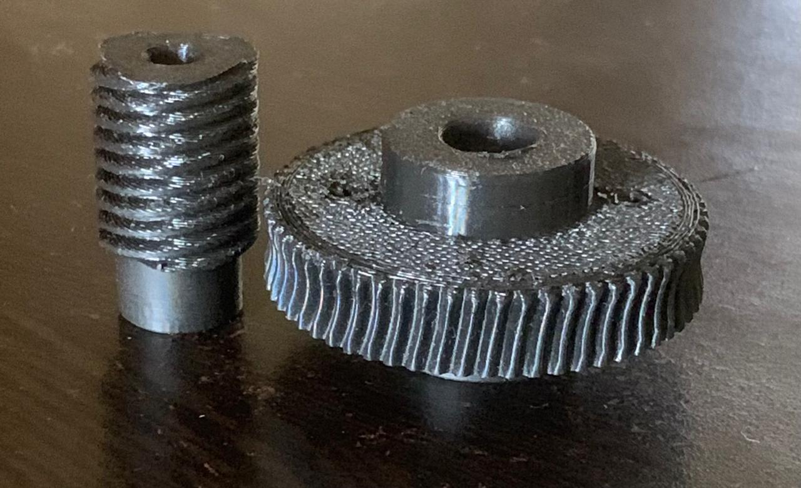

# Hybrid Multi-Mode End Effector for Industrial Robots

> A 2-in-1 robotic end effector combining a 3-jaw gripper and a vacuum suction system — designed to replace two separate end effectors with a single, versatile unit.

---

## Overview

Most industrial robot setups require swapping between a mechanical gripper and a vacuum suction cup depending on the object being handled. This project eliminates that need by integrating both mechanisms into one compact end effector that can:

- **Grip** irregularly shaped, cylindrical, or solid objects using 3 synchronized jaws
- **Pick flat surfaces** like cardboard boxes, panels, and sheets using a central vacuum suction array

The result is a single end effector that reduces cost, downtime, and mechanical complexity in automation pipelines.

---

## Key Features

| Feature | Details |
|---|---|
| Gripper Type | 3-jaw synchronized gripper |
| Drive Mechanism | NEMA 17 stepper motor + 20:1 worm gear |
| Fail-Safe | Worm gear self-locking — holds position on power loss |
| Suction System | Mini DC air pump with vacuum suction cup array |
| Suction Payload | ~400g – 500g (expected) |
| Gripper Payload | Dependent on robot arm/manipulator motor specs |
| Fabrication | 3D printed structural components |

---

## Motivation

In industrial and collaborative robotics, end effectors are often task-specific. A gripper handles one class of objects; a suction cup handles another. Switching between them requires either manual intervention or an expensive automatic tool changer.

This project proposes a **hybrid approach**: a mechanically integrated dual-mode end effector that handles both paradigms without reconfiguration — making it particularly suitable for pick-and-place tasks in logistics, light manufacturing, and research environments.

---

## Mechanical Design

### 3-Jaw Gripper

- Three jaws are driven **synchronously** through a central gear mechanism, ensuring even clamping force across all contact points.
- Power is transmitted via a **20:1 worm gear reduction**, giving the gripper high torque output from a relatively small stepper motor.
- The worm gear is **inherently self-locking**: when power is cut, the gear cannot back-drive, meaning gripped objects remain held securely — a critical safety feature for industrial use.
- Actuated by a **NEMA 17 stepper motor**, allowing precise position control of jaw opening/closing.

### Vacuum Suction System

- A **mini DC air pump** generates the vacuum.
- The suction interface features **multiple suction cups arranged in an array** at the end effector face, improving contact stability on flat and slightly uneven surfaces.
- Designed to handle flat objects such as cardboard boxes, plastic sheets, and panels.
- A **solenoid valve** controls suction activation and release.
- Expected payload: **400g – 500g**.

### Worm Gear (3D Printed)

- Custom-designed worm and worm wheel, 3D printed for prototyping.
- Gear ratio: **20:1**, providing a 20× torque multiplication at the output.
- The self-locking property of the worm drive means the jaws cannot be forced open by external loads when unpowered.

---

## Components

### Mechanical
- 3D printed gripper body, jaws, and gear housing (PLA/PETG — material selection ongoing)
- Custom worm gear set (20:1 ratio, 3D printed)
- Jaw linkage and synchronization mechanism

### Actuation & Pneumatics
- NEMA 17 stepper motor
- Mini DC air pump (DC 4.5V, model JQB2438274)
- Mini solenoid valve
- Silicone vacuum tubing
- Suction cup array (octagonal arrangement, 1 large center + 8 peripheral cups)

### Electronics *(to be integrated)*
- Stepper motor driver (e.g., A4988 / DRV8825)
- Microcontroller (e.g., Arduino / STM32)
- Pump and solenoid relay/MOSFET control circuit
- Power supply / robot arm interface

---

## Project Status

This project is an active **work in progress**.

- [x] Conceptual design complete
- [x] CAD model designed (full assembly)
- [x] Worm gear set 3D printed and prototyped
- [x] Gripper body rough prototype printed
- [ ] Final material selection for structural parts
- [ ] Remaining components procurement
- [ ] Electronics assembly and wiring
- [ ] Firmware / motor control code
- [ ] Integration testing with robot arm
- [ ] Payload validation and stress testing

---

## CAD & Design

<p align="center">
  
  <br>
  <em>Isometric View</em>
</p>
<br>

<p align="center">
  
  <br>
  <em>Front View</em>
</p>
<br>

<p align="center">
  
  <br>
  <em> Vacuum cup with level compensator (Spring Buffer)</em>
</p>
<br>

<p align="center">
  
  <br>
  <em>3D printed gears in PLA material</em>
</p>
<br>

*(CAD files and renders available in the `/CAD` directory)*

---

## Working

```
Power ON  →  NEMA 17 spins  →  Worm drives worm wheel  →  Jaws close/open
Power OFF →  Worm gear self-locks  →  Jaws hold position (fail-safe)

Pump ON   →  Vacuum generated  →  Suction cup grips flat surface
Solenoid  →  Opens on release  →  Object dropped cleanly
```

The two modes can be used **independently or simultaneously** depending on the object geometry and task requirements.

---

## Function of Worm Gear?

Most gripper designs use rack-and-pinion or bevel gears. A worm drive was chosen here for three specific reasons:

1. **High reduction ratio in a compact form** — 20:1 in a single stage
2. **Self-locking** — the lead angle of the worm prevents back-driving under load
3. **Smooth, quiet operation** — important for collaborative robot environments

The trade-off is lower efficiency (~40–60%) compared to spur gears, but for a gripper that holds position most of the time, this is an acceptable compromise.

---

## Future Work

- Integrate force/torque sensing for adaptive gripping
- Add pressure sensing to suction circuit for pick confirmation
- Explore PETG or Nylon for final printed parts (better mechanical strength)
- Validate payload capacity through physical testing

---

## Author

RAYHAAN T 
<br>
Final Year Mechanical Engineering Student | Robotics Enthusiast  
📍 Chennai, India  
🔗 linkedin.com/in/rayhaan-t-742709290/
